[

  

](https://capsule-render.vercel.app/api?type=waving&height=280&color=0:000000,100:a371f7&text=VIKASH%20KUMAR%20JHA&fontSize=55&fontColor=FFFFFF&animation=fadeIn&fontAlignY=45&desc=🔐%20Aspiring%20Cybersecurity%20Analyst%20%7C%20Google%20Certified%20%7C%20ISO%2027001%20Lead%20Auditor%20%7C%20Blue%20Teaming%20Expert%20(Top%201%25%20TryHackMe)&descSize=18&descColor=FFFFFF&descAlignY=70" width="100%"/>

)

  

## 📌 About Me
- 🚀 Aspiring Cybersecurity Analyst passionate about threat analysis and network security.
- 🔒 Google Cybersecurity Certified with expertise in incident response and security frameworks.
- 📜 ISO/IEC 27001:2022 Lead Auditor skilled in risk management and compliance.
- 🛡️ Blue Teaming enthusiast with hands-on experience in ethical hacking (Top 1% TryHackMe).
- ☁️ Focused on securing cloud environments and building resilient systems.
- 💼 Open to Information Security Analyst / SOC Intern roles.

## 🧠 My Focus Areas
- 🔍 Threat Analysis & Incident Response
- 🛡️ Network Security & Blue Teaming
- ☁️ Cloud Security & Compliance
- 🤖 Machine Learning for Cybersecurity
- 📊 Risk Management & ISO 27001

## 📊 GitHub Stats & Trophies

  
  

  

  

  

## 🛠️ Languages & Tools

<h3 align="center">Programming Languages</h3>

  &nbsp;
  &nbsp;
  &nbsp;
  &nbsp;
  &nbsp;
  

<h3 align="center">Frontend</h3>

  &nbsp;
  &nbsp;
  &nbsp;
  &nbsp;
  

<h3 align="center">Backend</h3>

  &nbsp;
  

<h3 align="center">Database</h3>

  &nbsp;
  &nbsp;
  

<h3 align="center">DevOps & Cloud</h3>

  &nbsp;
  &nbsp;
  &nbsp;
  &nbsp;
  

<h3 align="center">Tools</h3>

  &nbsp;
  &nbsp;
  &nbsp;
  

  

 

## 🔗 Connect with Me

  &nbsp;&nbsp;
  &nbsp;&nbsp;
  &nbsp;&nbsp;
  

<picture>
  <source media="(prefers-color-scheme: dark)" srcset="https://raw.githubusercontent.com/abozanona/abozanona/output/pacman-contribution-graph-dark.svg">
  <source media="(prefers-color-scheme: light)" srcset="https://raw.githubusercontent.com/abozanona/abozanona/output/pacman-contribution-graph.svg">
  
</picture>

  

